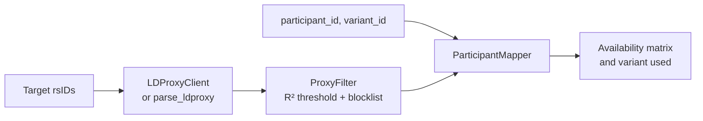

# LD Linkage Mapper

[](https://github.com/dsugurtuna/ld-linkage-mapper/actions/workflows/ci.yml)

Find linkage disequilibrium (LD) proxies for variants that are not on your genotyping array, and work out which participants have data for each target through a proxy.

> **Portfolio project.** Built as a generalised demonstration of LD proxy workflows. No real participant data is included.

**Where this fits:** part of my clinical genomics and biobank data work.
[snp-feasibility-checker](https://github.com/dsugurtuna/snp-feasibility-checker) and
[biobank-variant-explorer](https://github.com/dsugurtuna/biobank-variant-explorer) tell you which
targets are typed directly; this repo covers the ones that are not; and
[recall-study-generator](https://github.com/dsugurtuna/recall-study-generator) turns availability into
a recall design.

## The problem

A researcher asks for participants with a specific variant, but that variant is not on the array
some or all participants were genotyped on. Nearby variants are often inherited together, so a
variant in perfect LD with the target can stand in for it. Doing this by hand means querying LDlink
per variant, filtering the tables, and cross-referencing each participant's typed variants.

## What this does

- **Queries LDlink LDproxy** (`LDProxyClient`) one variant at a time, rate limited, or parses a
  saved LDproxy table offline (`parse_ldproxy`). Columns are read by header name, the query
  variant's own row is dropped, and API errors come back in `ProxyResult.error`.
- **Filters proxies** (`ProxyFilter`) by an R² threshold (default 1.0) and an optional blocklist of
  rsIDs you do not trust, such as probes that failed QC.
- **Maps to participants** (`ParticipantMapper`) from a long-format file of
  `participant_id,variant_id`, and records *which* variant gives each participant data for each
  target: the target itself if typed, otherwise the highest-R², nearest proxy.
- **Exports** a participant-by-target CSV, as Yes/No or as the rsID used.

## Quickstart

```bash
git clone https://github.com/dsugurtuna/ld-linkage-mapper.git
cd ld-linkage-mapper
python -m venv .venv && source .venv/bin/activate
pip install -e ".[dev]"
pytest
python examples/demo.py
```

The demo runs on synthetic data in `examples/data` (made-up rsIDs, LD values and participants, in
the real LDproxy column layout). Its output, which `tests/test_demo.py` checks:

```text
rs9000001: 4 candidate proxy row(s) from LDproxy
rs9000002: 1 candidate proxy row(s) from LDproxy
rs9000001: kept 1 (rs9000011); blocklisted 1
rs9000002: kept 0 (none); blocklisted 0

participant   rs9000001   rs9000002
SYN001        rs9000001   rs9000002
SYN002        rs9000011           -
SYN003                -           -
SYN004                -           -
SYN005                -           -

rs9000001: 2 of 5 participants
rs9000002: 1 of 5 participants
```

SYN003 only has a blocklisted proxy, and SYN004 only has a proxy with R² 0.93, so neither counts at
the default threshold.

To query LDlink live you need a free API token from
[LDlink API access](https://ldlink.nih.gov/?tab=apiaccess):

```python
from ld_mapper import LDProxyClient, ParticipantMapper, ProxyFilter

client = LDProxyClient(token="YOUR_TOKEN", population="GBR", genome_build="grch38")
results = client.query_batch(["rs429358", "rs7412"])
filtered = ProxyFilter(min_r2=1.0).filter_batch(results)
mapping = ParticipantMapper("participant_variants.csv").map(filtered)
ParticipantMapper.export_csv(mapping, "availability.csv", show_source=True)
```

## How it works



## Design decisions

- **Columns by header name, not position.** The response carries annotation columns after the LD
  columns. Reading by name means an added or reordered column cannot silently shift R² into the
  wrong field.
- **Drop the query variant's own row.** LDproxy lists the target first with R² 1.0. Counting it as
  a proxy inflates the proxy count and hides the case where there is no real proxy.
- **Record the variant used, not just Yes/No.** Whoever genotypes or analyses the recall needs to
  know which rsID to read, and the legacy script kept this as `alternative_rsid`.
- **Default R² = 1.0.** A recall decision is about individuals, so an imperfect proxy misclassifies
  some people. Lower thresholds are allowed but are an explicit choice.
- **Errors returned, not raised, in batch queries.** One bad rsID should not stop a long list;
  every failure stays visible in `ProxyResult.error`.
- **No third-party dependencies.** The standard library is enough, which keeps installation simple
  in locked-down research environments.

## Limitations and what this is not

- LD comes from a small 1000 Genomes reference population (GBR by default), not from your cohort.
  R² = 1.0 in the panel does not guarantee perfect tagging in your participants. Check concordance
  in a subset where both variants are typed before relying on a proxy.
- The tool reports *availability* of genotype data. It does not translate a proxy genotype into the
  target genotype. `ProxyVariant.correlated_alleles` holds LDproxy's allele pairing so that a
  downstream step can, but strand and allele alignment are not handled here.
- Matching is by rsID only. Array manifests that use probe IDs or positions need mapping to rsIDs
  first, and rsID merges between dbSNP builds are not handled.
- The live client is sequential and has no retry or caching.
- `legacy/` holds the original shell and Python scripts for reference. They are not tested.

## Roadmap

- Cache LDproxy responses on disk, keyed by variant, population and build.
- Optional concordance check between target and proxy where both are typed.
- A small CLI around the Python API.

## Development

```bash
make dev     # install with dev dependencies
make check   # ruff lint and format check, mypy, pytest
```

See [docs/WHY.md](docs/WHY.md) for the reasoning behind the design, and
[CONTRIBUTING.md](CONTRIBUTING.md) to contribute.

## Licence

MIT is declared in `pyproject.toml`, but no licence file is included yet.

---

Personal project by [Ugur Tuna](https://github.com/dsugurtuna). Not affiliated with or endorsed by any employer.
